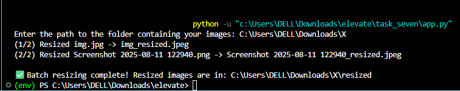

# Batch Image Resizer 🖼️

A simple, command-line Python script to batch resize all images in a specified folder to a new dimension and save them in a desired format.

---

## 📜 Description

This script provides an efficient way to process multiple images at once. You simply point it to a folder containing your images, and it will:
1.  Create a new subfolder named `resized` within your original folder.
2.  Read each image file.
3.  Resize it to a predefined dimension (e.g., 800x600 pixels).
4.  Save the resized image in the `resized` subfolder with a new format (e.g., JPEG).
5.  Provide real-time progress and handle common errors gracefully.

---

## ✨ Features

-   **Batch Processing**: Resizes all image files in a directory automatically.
-   **User-Friendly**: Prompts the user for the input folder path.
-   **Organized Output**: Saves resized images in a separate `resized` subfolder to avoid overwriting original files.
-   **Format Conversion**: Converts images to a specified output format (default is JPEG).
-   **Robust Error Handling**:
    -   Checks if the input path exists and is a directory.
    -   Gracefully skips files that are not valid images.
    -   Handles potential issues with image color modes (e.g., converting RGBA from PNG to RGB for JPEG saving).
-   **Progress Tracking**: Displays the progress of the resizing process in the console.

---

## 📚 Libraries & Dataset

### Libraries Used

-   **Pillow (PIL Fork)**: The core library used for all image manipulation tasks, including opening, resizing, converting color modes, and saving images. It's a powerful and easy-to-use library for Python.
-   **os**: A standard Python library used for interacting with the operating system. In this script, it's used for path manipulation (`os.path.join`, `os.path.splitext`), creating directories (`os.makedirs`), and listing directory contents (`os.listdir`).

### Dataset

This script does not require a specific dataset. It is designed to work with **any collection of image files** provided by the user. You can use it on your personal photo collections, datasets for machine learning, or any folder containing image formats supported by Pillow (like PNG, JPEG, BMP, GIF, etc.).

---

## 🚀 How to Use

1.  **Prerequisites**: Make sure you have Python installed on your system.
2.  **Install Pillow**: Open your terminal or command prompt and install the required library:
    ```bash
    pip install Pillow
    ```
3.  **Run the Script**: Save the code as a Python file (e.g., `resize_script.py`) and run it from your terminal:
    ```bash
    python resize_script.py
    ```
4.  **Enter Path**: The script will prompt you to provide the path to the folder containing the images you want to resize.
    ```
    Enter the path to the folder containing your images: /path/to/your/images
    ```
5.  **Done!**: The script will start processing. Once finished, you will find all the resized images inside a new `resized` subfolder within your original image folder.

    Example output:
    ```
    (1/10) Resized photo1.png -> photo1_resized.jpeg
    (2/10) Resized photo2.jpg -> photo2_resized.jpeg
    ...
    Skipping document.pdf: Not a valid image file.
    ...
    (10/10) Resized photo10.bmp -> photo10_resized.jpeg

    ✅ Batch resizing complete! Resized images are in: /path/to/your/images/resized
    ```

---



##  dissecting the code

Here's a breakdown of the script's components.

### Full Code

```python
import os
from PIL import Image

def batch_resize_images(input_path, output_path, size, file_format):
    # 1. Create output directory if it doesn't exist
    if not os.path.exists(output_path):
        os.makedirs(output_path)

    # 2. Handle invalid input path
    try:
        files = os.listdir(input_path)
    except FileNotFoundError:
        print(f"Error: The folder '{input_path}' was not found. Please check the path and try again.")
        return
    except NotADirectoryError:
        print(f"Error: The path '{input_path}' is a file, not a folder. Please enter a folder path.")
        return

    # 3. Filter for files only (exclude subdirectories)
    image_files = [f for f in files if os.path.isfile(os.path.join(input_path, f))]

    if not image_files:
        print(f"No image files found in '{input_path}'.")
        return

    # 4. Loop through and process each image
    for i, filename in enumerate(image_files):
        input_filepath = os.path.join(input_path, filename)
        file_basename, _ = os.path.splitext(filename)
        output_filepath = os.path.join(output_path, f"{file_basename}_resized.{file_format.lower()}")

        try:
            # 5. Open, resize, and save
            with Image.open(input_filepath) as img:
                resized_img = img.resize(size)
                
                # 6. Convert to RGB for JPEG compatibility
                if file_format.upper() == 'JPEG':
                    resized_img = resized_img.convert('RGB')
                
                resized_img.save(output_filepath, format=file_format)
                print(f"({i+1}/{len(image_files)}) Resized {filename} -> {os.path.basename(output_filepath)}")

        # 7. Skip non-image files
        except (IOError, SyntaxError, Image.UnidentifiedImageError):
            print(f"Skipping {filename}: Not a valid image file.")

# 8. Main execution block
if __name__ == "__main__":
    # --- Configuration ---
    new_size = (800, 600)
    output_format = 'JPEG'
    output_folder_name = 'resized'
    
    # --- User Input ---
    input_folder = input("Enter the path to the folder containing your images: ").strip()

    # --- Run the function ---
    if input_folder:
        output_folder = os.path.join(input_folder, output_folder_name)
    
        batch_resize_images(
            input_path=input_folder,
            output_path=output_folder,
            size=new_size,
            file_format=output_format
        )
        print(f"\n✅ Batch resizing complete! Resized images are in: {output_folder}")
    else:
        print("No input folder provided. Exiting.")
